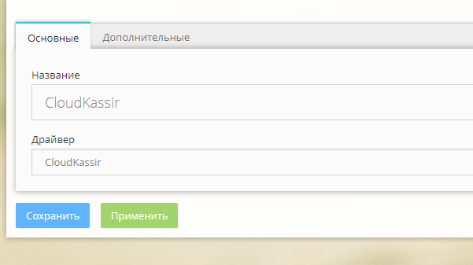
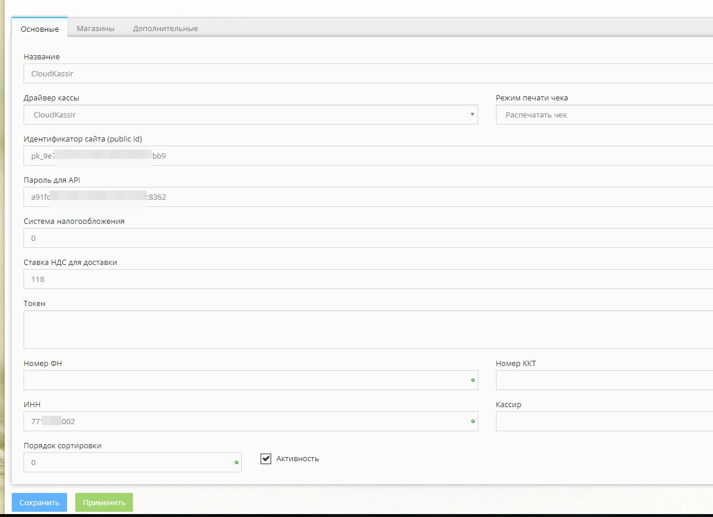
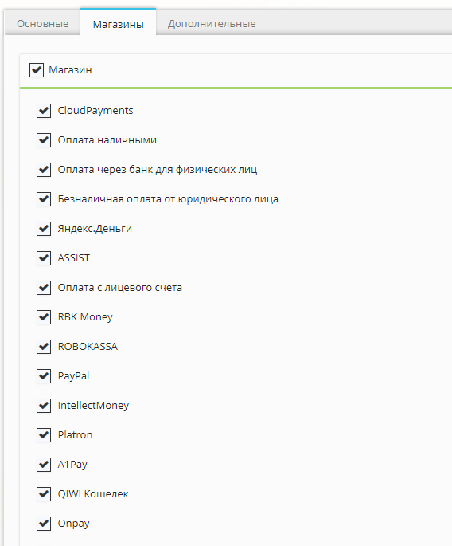
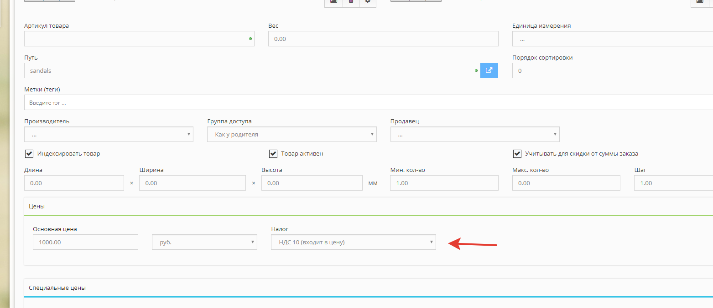
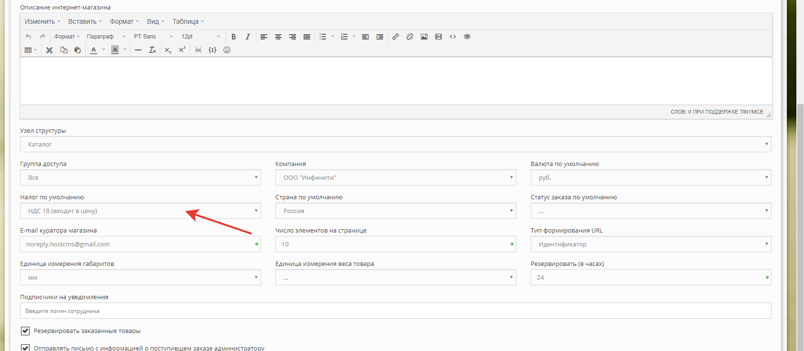
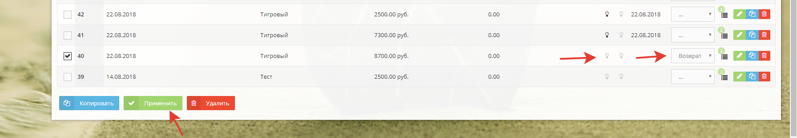

#  CloudKassir модуль для HostCMS

Модуль позволяет интегрировать онлайн-кассу [CloudKassir](https://cloudkassir.ru) в интернет-магазине на  HostCMS.
Для корректной работы модуля необходима регистрация в сервисе.

### Возможности:  
	
* Автоматическая отправка чеков прихода;
* Отправка чеков возврата прихода;
* Отправка чеков на email клиента;
* Отправка чеков по SMS;


### Совместимость:
HostCMS 6.8.3 и выше;

_Если вы используете платежный модуль CloudPayments совместно с модулем CloudKassir, то убедитесь, что в платежном модуле отключена отправка чеков через онлайн-кассу, во избежание дублирования кассовых чеков._

## Установка модуля
1. Установите модуль "Кассы для 54-ФЗ"
1. Разархивируйте драйвер и скопируйте каталог cloudkassir в modules/cashregister
2. В файле modules/cashregister/config/driver.php добавтье cloudkassir.
```php
<?php 

return array(
	'buhsoft' => 'Бухсофт',
	'lifepay' => 'Lifepay',
	'komtet' => 'Комтет Касса',
	'modulkassa' => 'Модуль Касса',
	'atol' => 'Атол Онлайн',
	'cloudkassir' => 'CloudKassir',
);
```
3. В разделе "Кассы" перейдите на страницу "Драйверы" и добавтье новый драйвер. В качестве драйвера выбрать "cloudkassir"

4. В разделе "Кассы" добавтье новую кассу в которой в поле "драйвер" выберите "CloudKassir" 

## Настройка модуля

В разеде "Кассы" выберите "Редактировать" у кассы "CloudKassir" и укажите настройки:
* **Идентификатор сайта** — Public id сайта из личного кабинета CloudPayments
* **Пароль для API** — API Secret из личного кабинета CloudPayments
* **ИНН** — ИНН организации, на которую зарегистрирована онлайн-касса
* **Система налогообложения** — Тип системы налогообложения от 0 до 5.
    Возможные значения перечислены в [документации CloudPayments](https://cloudpayments.ru/wiki/integration/instrumenti/apikassa#var)
* **Ставка НДС для доставки** — Указание отдельной ставки НДС для доставки.
    Если доставка платная, то она в чеке оформляется отдельной строкой со своей ставкой НДС.
    Все возможные значения указаны в [документации](https://cloudpayments.ru/wiki/integration/instrumenti/apikassa#nds)



На странице "Магазин" выбирите способы оплаты, для которых требуется пробивать чек.


Затем сохранить введенные параметры.

## Настройка ставки НДС для товаров
Обратите внимание что ставка НДС для товаров берется из свойства товара.

Если ставка НДС не указана, равна 0 или указана "без налога", то в чеке ставка НДС указывается как "Без НДС".

Вы можете указать ставку НДС по умолчанию для новых товаров в настройках магазина "Контент" -> "Интернет-магазины", найти требуемый магазин и перейти в редактирование:




## Настройка печати чека возврата

Чтобы была возможность печатать чек возврата необходимо вручную добавить статус заказа "Возврат" или "Refund"
"Контент" -> "Интернет-магазины" -> "Справочники" -> "Статусы заказов"

Для печати чека возврата в списке заказов установите статус "Возврат" у требуемых заказов, а также снимите статус "Оплачен" и "Отменен".
Затем нажмите кнопку "Применить".


Возврат работает только из списка заказов. При редактировании заказа он не действует. 
